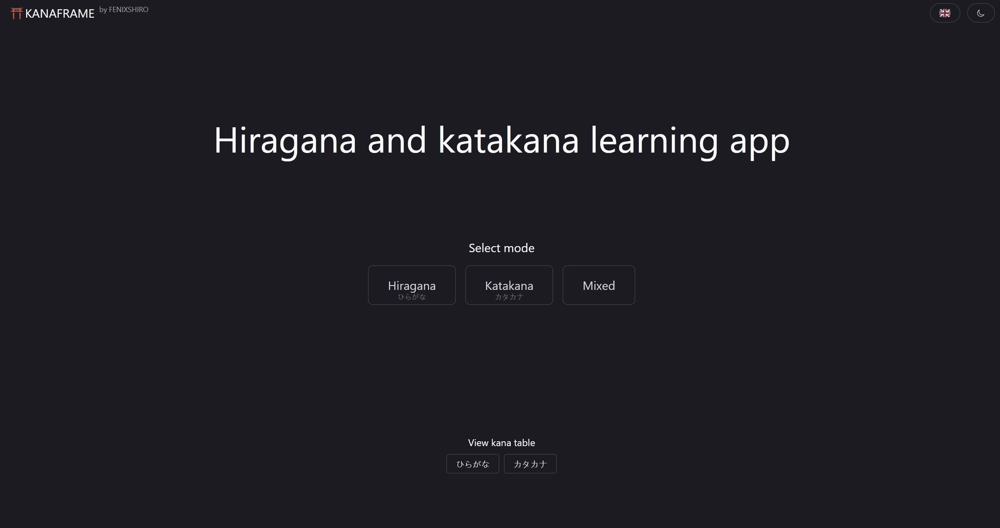

# KANAFRAME

Hiragana and Katakana Learning App is a beginner-friendly tool designed to help users learn the two basic Japanese syllabaries.

## Screenshots

## Roadmap

- Yōon learning

- Selectable answer mode
  
- Saveable learning progression
  
- Offline mode

